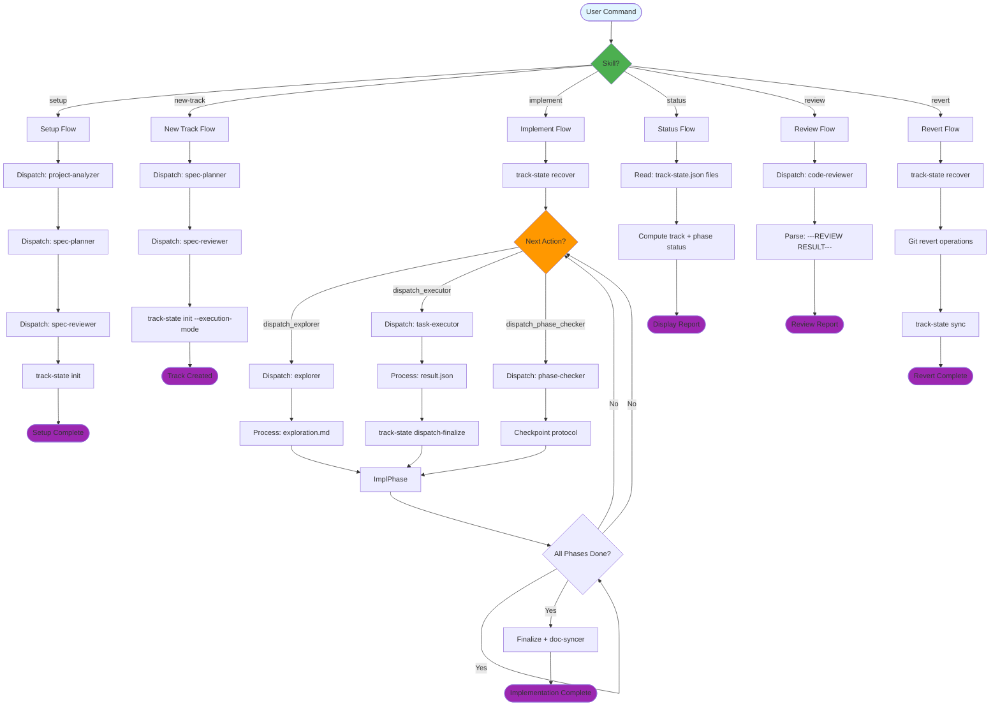
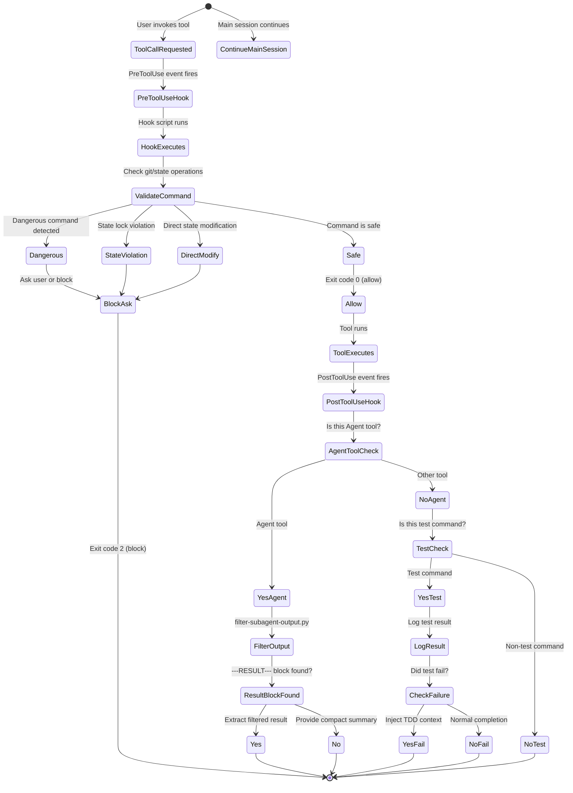
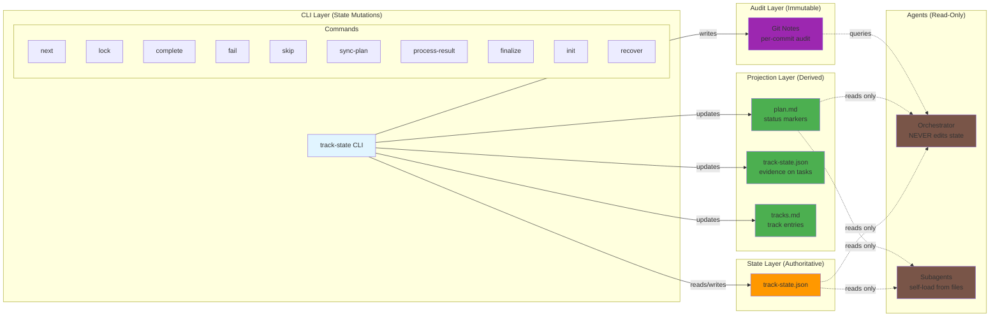
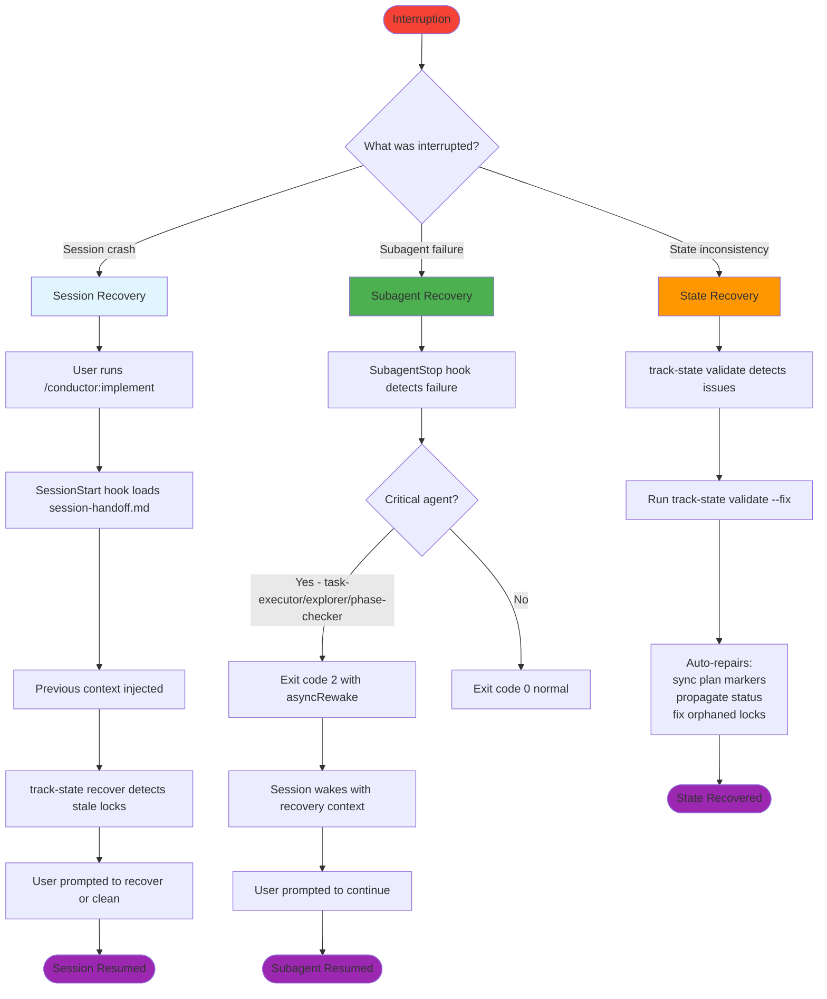
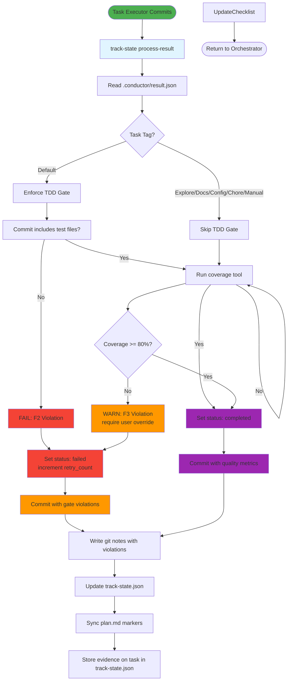
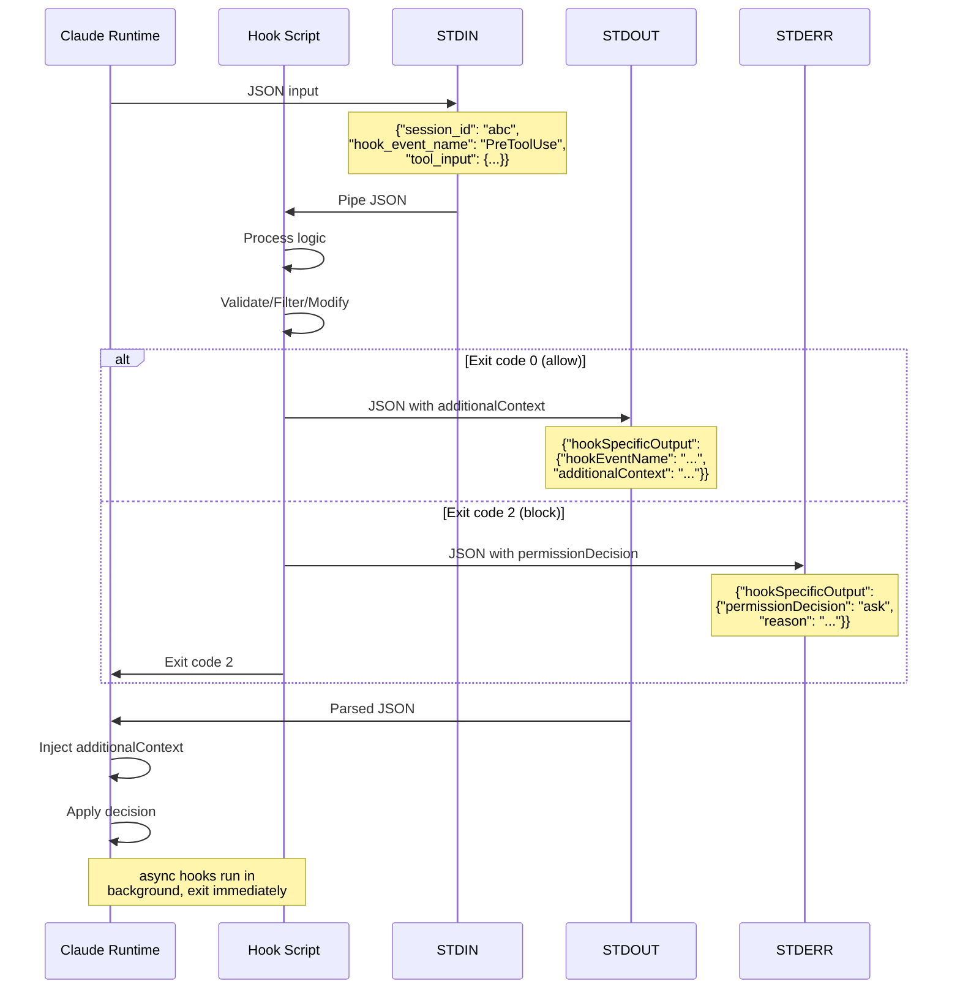
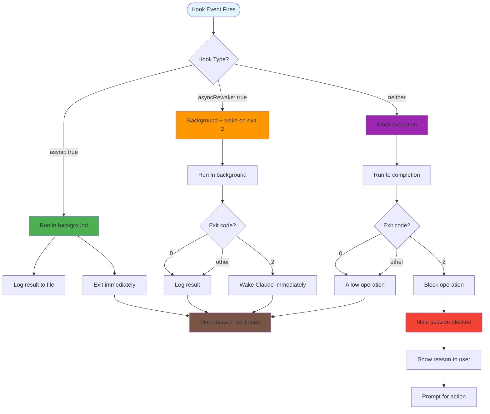
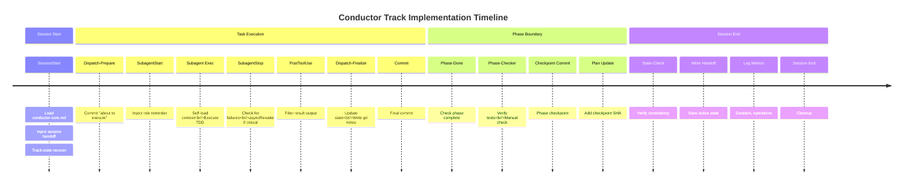

# Conductor Interaction Flow Diagrams

## Master Flow: From User Command to Task Completion



## Detailed Hook Flow: Tool Execution Lifecycle



## Subagent Isolation: Context Loading Pattern

```mermaid
graph TB
    subgraph "Orchestrator (Minimal Context)"
        Orch[Orchestrator Agent]
        Orch -.->|dispatches| DispatchPrompt["TRACK_DIR=/path<br/>PHASE=0<br/>TASK=1<br/>NAME=task_name"]
    end

    subgraph "Subagent (Self-Loaded Context)"
        Sub[task-executor Agent]

        subgraph "Layer 0: Exploration Map"
            L0[exploration.md<br/>architecture<br/>gotchas<br/>file inventory]
        end

        subgraph "Layer 1: Task Identity"
            L1[plan.md<br/>task description<br/>AC/TC IDs]
        end

        subgraph "Layer 2: Acceptance Criteria"
            L2[spec.md<br/>relevant ACs<br/>test cases<br/>out-of-scope]
        end

        subgraph "Layer 3: Workflow & Style"
            L3A[task-workflow.md<br/>Steps 3-8]
            L3B[testing/strategy.md<br/>test conventions]
            L3C[code-styleguides/*<br/>language-specific rules]
        end

        subgraph "Layer 3.R: Retry Context"
            L3R[track-state get-handoff<br/>previous attempts<br/>failure details]
        end
    end

    DispatchPrompt --> Sub
    Sub --> L0
    Sub --> L1
    Sub --> L2
    Sub --> L3A
    Sub --> L3B
    Sub --> L3C
    Sub --> L3R

    Sub -->|executes TDD| Execution[TDD Workflow:<br/>Red→Green→Refactor]
    Execution -->|result.json| Result[""status": "SUCCESS",<br/>"commit_sha": "a1b2c3d",<br/>...]

    style Orch fill:#e1f5ff
    style Sub fill:#4caf50
    style L0 fill:#fff3e0
    style L1 fill:#ffe0b2
    style L2 fill:#ffcc80
    style L3A fill:#ffab91
    style L3B fill:#ffab91
    style L3C fill:#ffab91
    style L3R fill:#b388ff
```

## State Authority: Single Source of Truth



## Recovery Flow: Handling Interruptions



## Quality Gate Enforcement Flow



## Hook Communication: JSON Protocol



## Async vs Sync Hook Execution



## Complete Interaction Timeline


