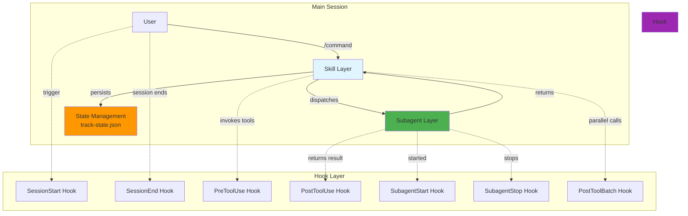
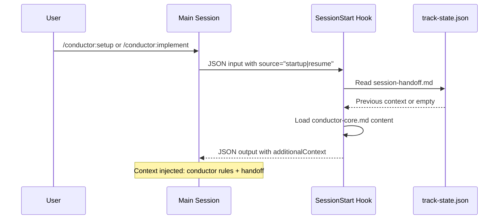
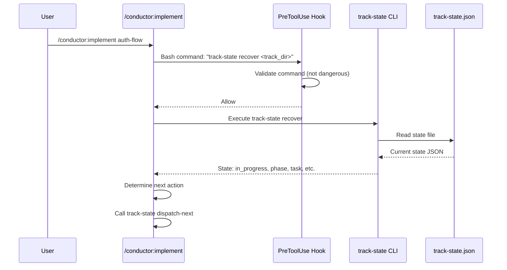
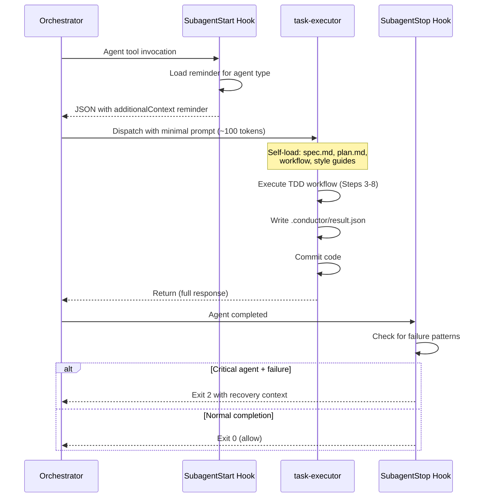
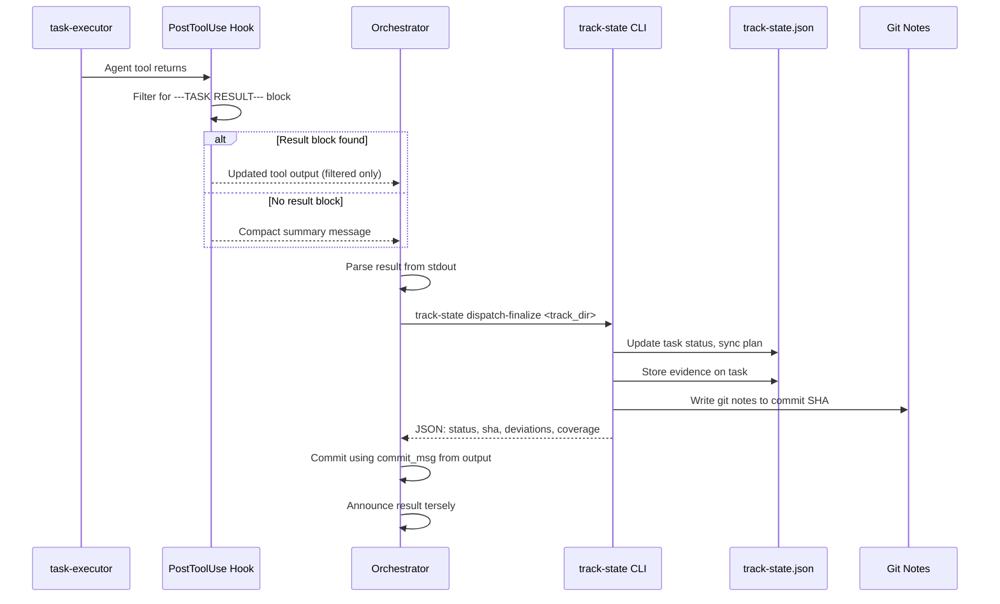
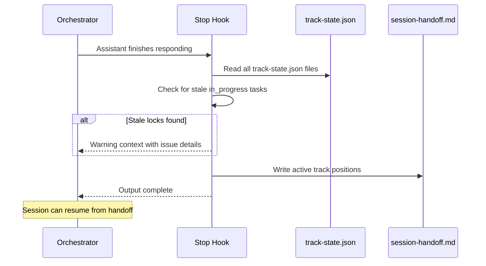
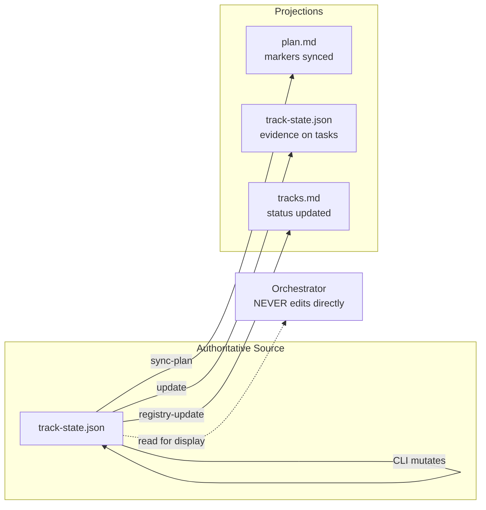
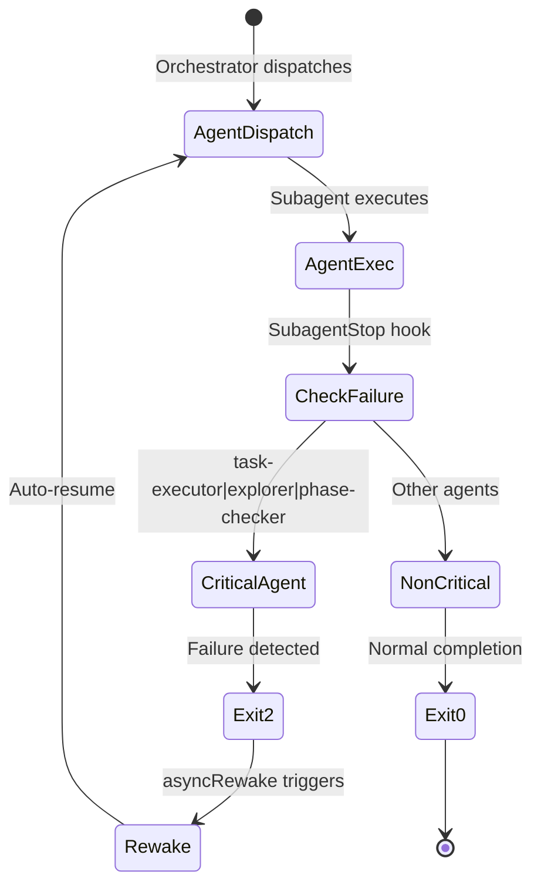
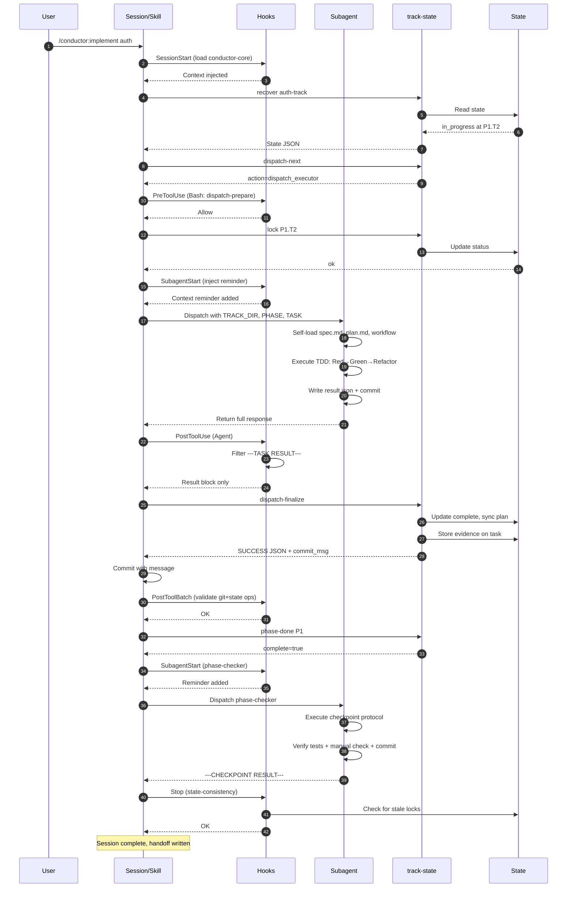

# Conductor Plugin: Interaction Mechanism Documentation

## Overview

The Conductor plugin implements a sophisticated three-tier interaction model consisting of **Skills**, **Subagents**, and **Hooks**. These components work together through a carefully orchestrated communication pattern that enables spec-driven development orchestration while maintaining context isolation and state consistency.

## System Architecture



## Component Definitions

### 1. Skills Layer

Skills are the primary user-facing command interface. Each skill is a self-contained execution unit with:

- **Frontmatter**: YAML metadata defining behavior, permissions, and lifecycle
- **Instructions**: Step-by-step execution protocol
- **File Structure**: `skills/<name>/SKILL.md`

| Skill | Purpose | Key Responsibilities |
|--------|---------|-------------------|
| `setup` | Initialize project environment | Scaffolding, track creation, subagent dispatch |
| `new-track` | Create new feature track | Requirements gathering, spec/plan generation |
| `implement` | Orchestrate task execution | State machine loop, subagent dispatch, result processing |
| `status` | Display project progress | State aggregation, status computation |
| `review` | Code review orchestration | Subagent dispatch, quality verification |
| `revert` | Safe rollback | State synchronization, git operations |

### 2. Subagents Layer

Subagents are specialized AI agents that execute specific tasks in isolated context. They inherit:

- **System Prompt**: From their `.md` definition file
- **Tools**: Restricted/allowlisted per agent
- **Hooks**: Agent-scoped lifecycle hooks
- **Permissions**: Pre-approved where specified

| Subagent | Model | Tools | Purpose |
|-----------|--------|--------|---------|
| `task-executor` | Sonnet | Bash, Read, Edit, Write, Grep, Glob, NotebookEdit | TDD workflow execution |
| `explorer` | Haiku | Bash, Read, Grep, Glob | Read-only codebase investigation |
| `phase-checker` | Sonnet | Bash, Read, Edit, Write, Grep, Glob, AskUserQuestion | Phase verification protocol |
| `code-reviewer` | Sonnet | Bash, Read, Grep, Glob | Deep code review |
| `skip-analyst` | Haiku | Read, Grep, Glob | Failed task analysis |
| `spec-planner` | Sonnet | Bash, Read, Edit, Write | Spec/plan generation |
| `spec-reviewer` | Sonnet | Read, Write | Interactive spec review |
| `doc-syncer` | Sonnet | Bash, Read, Edit, Write | Documentation sync |
| `project-analyzer` | Sonnet | Bash, Read, Grep, Glob | Project structure analysis |

### 3. Hooks Layer

Hooks are event-driven scripts that execute at specific lifecycle points. They receive JSON input and output JSON responses with optional decision control.

| Hook Type | Trigger | Key Scripts |
|-----------|---------|-------------|
| `SessionStart` | Session begins/resumes | `session-start.py` |
| `SessionEnd` | Session terminates | `session-end.py` |
| `PreToolUse` | Before tool execution | `pre-command-check.py` |
| `PostToolUse` | After tool success | `filter-subagent-output.py`, `on-test-run.py` |
| `PostToolBatch` | After parallel tools resolve | `on-batch-complete.py` |
| `SubagentStart` | Subagent spawns | `on-subagent-start.py` |
| `SubagentStop` | Subagent finishes | `on-subagent-stop.py` |
| `PreCompact`/`PostCompact` | Context compaction | `on-compact.py` |
| `Stop` | Assistant finishes | `state-consistency-check.py` |

## Communication Flow

### Phase 1: Session Initialization



**Key Interactions:**
1. `session-start.py` loads `conductor-core.md` full content on startup, compact version on resume
2. Previous session handoff is injected for recovery
3. Context is available before first user prompt

### Phase 2: Skill Dispatch



**Key Interactions:**
1. Skills invoke `track-state` CLI for all state mutations (never read JSON directly)
2. `pre-command-check.py` validates git commands and state lock violations
3. Output is parsed JSON with minimal fields: `status`, `phase`, `task`, etc.

### Phase 3: Subagent Dispatch



**Key Interactions:**
1. `on-subagent-start.py` injects role-specific reminders via `additionalContext`
2. Dispatch prompts are minimal: only task identity + file paths
3. Subagents self-load all context from files (Layer 0→3 loading pattern)
4. `on-subagent-stop.py` uses `asyncRewake: true` for critical agents (task-executor, explorer, phase-checker)

### Phase 4: Result Processing



**Key Interactions:**
1. `filter-subagent-output.py` extracts only delimited result blocks
2. `track-state process-result` enforces F2/F3 gates (TDD, coverage)
3. Git notes are written by CLI, not agents (zero agent context cost)
4. Plan markers are synced automatically via `sync-plan`

### Phase 5: State Consistency



**Key Interactions:**
1. `state-consistency-check.py` runs on implement skill stop
2. Detects stale in_progress tasks (locks >24h old)
3. Writes `session-handoff.md` for recovery
4. Non-blocking—only warns, does not halt

## Message Formats

### Hook Input Format (JSON via stdin)

```json
{
  "session_id": "abc123",
  "transcript_path": "/path/to/session.json",
  "cwd": "/project/dir",
  "hook_event_name": "PreToolUse",
  "tool_name": "Bash",
  "tool_input": {
    "command": "git status"
  }
}
```

### Hook Output Format (JSON via stdout)

```json
{
  "hookSpecificOutput": {
    "hookEventName": "PreToolUse",
    "additionalContext": "[Conductor] Context message...",
    "permissionDecision": "allow|deny|ask|defer",
    "permissionDecisionReason": "Reason for decision",
    "updatedInput": { "command": "modified command" }
  }
}
```

### Subagent Result Format

**Success:**
```
---TASK RESULT---
STATUS: SUCCESS
COMMIT_SHA: a1b2c3d
FILES_CHANGED: test/auth.test.ts, src/auth.ts
SUMMARY: Implemented OAuth2 login flow
TC_COVERAGE: TC-1.1, TC-1.2, TC-2.1
SPEC_DEVIATION: NONE
---END RESULT---
```

**Failure:**
```
---TASK RESULT---
STATUS: FAILURE
SUMMARY: Failed to implement OAuth2 callback
SUGGESTED_NEXT: Review OAuth2 provider documentation for correct callback URL format
---END RESULT---
```

## State Authority Model



**Principles:**
1. `track-state.json` is always the source of truth
2. Orchestrator never reads/writes state JSON directly
3. All mutations go through `track-state` CLI
4. Plan.md is a human-readable projection, synced automatically
5. Git notes provide immutable audit trail

## Hook Priority and Execution Order

### Single Tool Call Flow

```
User Command
    ↓
PreToolUse (can block)
    ↓
Tool Execution
    ↓
PostToolUse (can modify output)
    ↓
Continue to next tool or end response
```

### Parallel Batch Flow

```
Parallel Tool Calls (N tools)
    ↓
[PreToolUse × N] (can block individually)
    ↓
[Tool Executions × N]
    ↓
[PostToolUse × N] (can modify each output)
    ↓
PostToolBatch (sees all N results)
    ↓
Continue or Stop
```

### Agent Flow

```
Agent Tool Call
    ↓
SubagentStart (injects reminder)
    ↓
Subagent executes in isolation
    ↓
SubagentStop (async or asyncRewake)
    ↓
PostToolUse on Agent (filters output)
    ↓
Continue main session
```

## Context Isolation Strategy

### Layer 0: Exploration Map (Optional)
```python
# task-executor checks first
if exists(TRACK_DIR / "exploration.md"):
    read(exploration.md)  # Pre-computed by explorer
    # Extract: architecture, gotchas, file inventory
```

### Layer 1: Task Identity
```python
# Read plan.md, find task at Phase P, Task T
task_description, ac_ids, tc_ids = parse_task_line(plan_md)
```

### Layer 2: Acceptance Criteria
```python
# Read spec.md, extract only relevant ACs/TCs
for ac_id in ac_ids:
    criteria[ac_id] = spec.acceptance_criteria[ac_id]
```

### Layer 3: Workflow & Style
```python
# Load only what's needed
workflow = read(TRACK_DIR / "conductor/workflow/task-workflow.md")
style_guide = read(TRACK_DIR / f"conductor/workflow/code-styleguides/{lang}.md")
```

## Error Recovery Mechanisms

### Critical Agent Recovery



**Recovery Flow:**
1. `on-subagent-stop.py` detects failure patterns in last message
2. For critical agents, exits with code 2
3. `asyncRewake: true` configuration wakes Claude immediately
4. Orchestrator receives context: "[Conductor] agent-name reported failure. Auto-recovery triggered."
5. User runs `/conductor:implement` to continue

### State Recovery

```bash
# On session start, orchestrator runs:
track-state recover "<track_dir>"
track-state sync-plan "<track_dir>"
track-state validate --fix "<track_dir>"
```

**Recovery Actions:**
- Detect and repair orphaned `in_progress` states
- Sync plan.md markers with track-state.json
- Fix parent→subtask status propagation
- Resume from last valid state

## Quality Gate Enforcement

### F2: TDD Gate (Critical)

```python
# In track-state process-result
if task_has_commit() and not exempt_tag():
    # Check commit includes test files
    if not any(f for f in changed_files if f.startswith(test_prefix)):
        gate_fail("F2_VIOLATION", "No tests in commit")
```

### F3: Coverage Gate (Warning)

```python
# In track-state process-result
if not exempt_tag():
    if coverage_pct < 80:
        gate_fail("F3_VIOLATION", f"Coverage {coverage_pct}% < 80%")
```

### F1: Global State Lock (Critical)

```python
# In pre-command-check.py
def has_multiple_in_progress():
    count = sum(1 for task in tasks if task.status == "in_progress")
    return count > 1

if has_multiple_in_progress():
    block("F1_VIOLATION", "Multiple in_progress tasks detected")
```

## Performance Optimizations

### Context Budget Management

| Strategy | Location | Impact |
|----------|-----------|---------|
| Minimal dispatch prompts | Orchestrator→Subagent | ~100 tokens per dispatch |
| Filtered subagent output | `filter-subagent-output.py` | 90% reduction in context pressure |
| Layered context loading | Subagents | Load only needed files |
| Compact handoff | `session-start.py` | Reduced recovery context |
| Result-only parsing | Orchestrator | Ignore narrative, parse JSON only |

### Async Hook Execution

```json
{
  "type": "command",
  "command": "./scripts/on-subagent-stop.py",
  "async": true,
  "timeout": 5
}
```

**When to use:**
- Logging-only hooks (fire-and-forget)
- Non-critical agents (code-reviewer, doc-syncer)
- Background telemetry

```json
{
  "type": "command",
  "command": "./scripts/on-subagent-stop.py",
  "asyncRewake": true,
  "timeout": 30
}
```

**When to use:**
- Critical agents requiring recovery (task-executor, explorer, phase-checker)
- State lock violations requiring immediate attention

## Complete Lifecycle Example



## Conclusion

The Conductor plugin's interaction mechanism demonstrates a sophisticated pattern for:

1. **Separation of Concerns**: Skills orchestrate, subagents execute, hooks observe and validate
2. **Context Isolation**: Each component has minimal, scoped context
3. **State Authority**: Single source of truth with CLI-based mutations
4. **Recovery**: Multiple mechanisms for handling failures and interruptions
5. **Performance**: Aggressive context optimization for cost and efficiency

This three-tier model enables complex, multi-step development workflows while maintaining auditability, recoverability, and quality enforcement.
