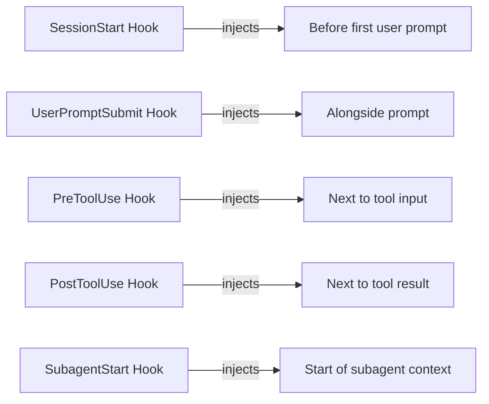

# Conductor Plugin: Interaction Reference Guide

## Quick Reference

### Component Interaction Matrix

| Component | Communicates With | Primary Protocol | Direction |
|-----------|------------------|-----------------|------------|
| **Skills** | User, Subagents, track-state CLI | Skill instructions → Agent dispatch | User→Skill, Skill→Subagent |
| **Subagents** | Orchestrator (skills), file system | Result blocks → JSON parsing | Skill→Subagent→Skill |
| **Hooks** | Runtime, file system, git | JSON in → JSON out | Runtime↔Hook |
| **track-state CLI** | Skills, state files | CLI commands → JSON responses | Skill→CLI |
| **track-state.json** | All components (read-only for agents) | File I/O | CLI←→State, Agent←→State |

## Hook Event Reference

### Session Lifecycle Hooks

| Event | Trigger | Can Block | Output Type | Key Scripts |
|--------|---------|------------|--------------|
| `SessionStart` | Session begins | No | additionalContext | `session-start.py` |
| `SessionEnd` | Session ends | No | logging only | `session-end.py` |
| `PreCompact` | Before compaction | Yes | decision: "block" | `on-compact.py` |
| `PostCompact` | After compaction | No | additionalContext | (none) |

### Tool Execution Hooks

| Event | Trigger | Can Block | Output Type | Key Scripts |
|--------|---------|------------|--------------|
| `PreToolUse` | Before any tool | Yes | permissionDecision | `pre-command-check.py` |
| `PostToolUse` | After tool success | Yes | updatedToolOutput | `filter-subagent-output.py`, `on-test-run.py` |
| `PostToolUseFailure` | After tool failure | No | additionalContext | (none) |
| `PostToolBatch` | After parallel batch | Yes | decision: "block" | `on-batch-complete.py` |

### Subagent Lifecycle Hooks

| Event | Trigger | Can Block | Output Type | Key Scripts |
|--------|---------|------------|--------------|
| `SubagentStart` | Subagent spawns | No | additionalContext | `on-subagent-start.py` |
| `SubagentStop` | Subagent finishes | Yes | decision: "block" | `on-subagent-stop.py` |

### Orchestrator Hooks

| Event | Trigger | Can Block | Output Type | Key Scripts |
|--------|---------|------------|--------------|
| `Stop` | Assistant finishes | Yes | decision: "block" | `state-consistency-check.py` |

## Subagent Dispatch Reference

### Standard Dispatch Format

```bash
Agent(
    prompt="TRACK_DIR=/abs/path PHASE=0 TASK=1 NAME=task_name ATTEMPT=1 MAX_RETRIES=3 IS_RETRY=false",
    subagent_type="conductor:task-executor"
)
```

### Subagent Input Parameters

| Parameter | Required | Description | Example |
|-----------|------------|-------------|----------|
| `TRACK_DIR` | Yes | Absolute path to track directory | `/project/conductor/tracks/auth-flow` |
| `PHASE` | Yes | Phase index (0-based) | `0` |
| `TASK` | Yes | Task index within phase | `1` |
| `SUBTASK` | No | Subtask index, or null for flat tasks | `null` |
| `NAME` | Yes | Human-readable task name | `"Implement OAuth2 login"` |
| `ATTEMPT` | No | Current attempt (1=fresh, 2+=retry) | `1` |
| `MAX_RETRIES` | No | Maximum retry count | `3` |
| `IS_RETRY` | No | `true` if retry, `false` otherwise | `false` |

### Subagent Output Formats

#### task-executor Result

```
---TASK RESULT---
STATUS: SUCCESS|FAILURE
COMMIT_SHA: <hash or N/A>
FILES_CHANGED: <comma-separated or N/A>
SUMMARY: <one-line>
TC_COVERAGE: <IDs or N/A>
SPEC_DEVIATION: NONE|<description>
---END RESULT---
```

#### phase-checker Result

```
---CHECKPOINT RESULT---
STATUS: PASSED|FAILED
CHECKPOINT_SHA: <hash or N/A>
MISSING_TESTS_CREATED: <count or 0>
TESTS_PASSED: <true|false>
USER_CONFIRMED: <true|skipped_continuous>
FAILURE_REASON: <description if FAILED>
---END RESULT---
```

#### skip-analyst Result

```
---SKIP ANALYSIS---
```json
{
  "can_skip": true,
  "impact": "description",
  "recommendation": "skip|pause_and_escalate|retry_with_modification",
  "reasoning": "detailed reasoning"
}
```
---END ANALYSIS---
```

## track-state CLI Reference

### Command Output Format

All `track-state` commands return JSON:

```json
{
  "ok": true,
  "status": "completed",
  "sha": "a1b2c3d",
  "parent_completed": true,
  "phase": 0,
  "task": 1,
  "subtask": null,
  "retry_count": 0,
  "deviations": [],
  "coverage_pct": 94,
  "tdd_gate": "pass|fail",
  "coverage_gate": "pass|warn|fail"
}
```

### Key Commands

| Command | Purpose | Key Output Fields |
|---------|---------|-----------------|
| `next` | Find dispatchable task | `phase`, `task`, `subtask`, `name`, `tags` |
| `recover` | Get recovery context | `status`, `phase_checkpoint_pending` |
| `lock <p> <t> [<s>]` | Set task to in_progress | `ok` |
| `complete <p> <t> [<s>] --sha <s>` | Set task to completed | `ok`, `parent_completed` |
| `fail <p> <t> [<s>] --summary <t>` | Set task to failed | `retry_count` |
| `skip <p> <t> [<s>] --reason <t>` | Set task to skipped | `ok` |
| `block <p> <t> [<s>] --reason <t>` | Set task to blocked | `ok` |
| `defer <p> <t> [<s>] --reason <t>` | Set task to deferred | `ok`, `parent_deferred` |
| `sync-plan` | Sync plan.md markers | `synced` |
| `registry-update <tracks-md>` | Update tracks.md status | `updated`, `status` |
| `phase-done <p>` | Check phase completion | `complete`, `total` |
| `add-checkpoint <p> <sha>` | Add checkpoint SHA | `ok`, `phase`, `sha` |
| `finalize` | Finalize track | `status`, `quality_score`, `checklist` |
| `process-result` | Process task result | `status`, `sha`, `deviations`, `gates` |
| `init` | Initialize track | `ok`, `track_id`, `phases`, `tasks` |

## Hook Decision Matrix

### PreToolUse Decision Values

| Decision | Effect | When to Use |
|-----------|---------|--------------|
| `allow` | Tool executes normally | Command is safe |
| `deny` | Tool is blocked | Dangerous operation detected |
| `ask` | User prompted for approval | Ambiguous or risky operation |
| `defer` | Pauses in -p mode | Non-interactive mode needs approval |

### Exit Code Semantics

| Exit Code | Effect on Hooks |
|-----------|----------------|
| `0` | Success, allow operation |
| `2` | Blocking error, wake main session (asyncRewake) |
| Other | Non-blocking error, log and continue |

## Context Injection Points

### Where additionalContext Appears



### Context Size Limits

| Hook Type | Max Context | Notes |
|-----------|--------------|-------|
| `SessionStart` | 10,000 characters | Excess saved to file |
| `SubagentStart` | Unlimited | Agent-specific reminders |
| `PreToolUse` | Unlimited | Usually minimal |
| `PostToolUse` | Unlimited | Filtered output reduces context |

## State Marker Mapping

### plan.md ↔ track-state.json

| track-state.json | plan.md Marker | Example Line |
|----------------|----------------|--------------|
| `pending` | `[ ]` | `- [ ] Implement login` |
| `in_progress` | `[~]` | `- [~] Implement login` |
| `completed` | `[x] ... [sha]` | `- [x] Implement login [a1b2c3d]` |
| `failed` | `[!] ... [sha]` | `- [!] Implement login [a1b2c3d]` |
| `skipped` | `[>] ... [sha]` | `- [>] Implement login [a1b2c3d]` |
| `blocked` | `[#] ... [sha]` | `- [#] Implement login [a1b2c3d]` |
| `cancelled` | `[-] ... [sha]` | `- [-] Implement login [a1b2c3d]` |

### SHA Location Rules

- **CORRECT**: `- [x] Task description [a1b2c3d]`
- **WRONG**: `- [x] [a1b2c3d] Task description`
- **ALWAYS**: At end of line, after any HTML comments

## Firewall Violation Detection

### Anti-Pattern Violations

| Code | Violation | Firewall | Detection Point |
|------|------------|------------|-----------------|
| V1 | Implementation before failing test | F2 | `track-state process-result` |
| V2 | Non-transient marker without SHA | F4 | `lint-track-state.py` |
| V3 | Skip coverage verification | F3 | `track-state process-result` |
| V4 | Skip Steps 4-7 | F2, F3 | Orchestrator validation |
| V5 | Bundle test + implementation | F2 | Orchestrator validation |
| V6 | Skip phase checkpoint | F5 | Orchestrator validation |
| V7 | Derive state from plan.md | State Lock | `pre-command-check.py` |
| V8 | Multiple in_progress | F1 | `pre-command-check.py` |
| V9 | Skip git notes | Audit | Orchestrator validation |
| V10 | Non-conventional commit | Quality | Orchestrator validation |
| V11 | Subagent modifying state | Orchestrator | `filter-subagent-output.py` |

## Recovery Scenarios

### Scenario 1: Session Crash During Subagent

```
1. User runs /conductor:implement
2. Orchestrator dispatches task-executor
3. task-executor commits code
4. Session crashes (network, client quit)
5. User runs /conductor:implement again
6. SessionStart hook loads session-handoff.md
7. track-state recover detects in_progress state
8. Orchestrator offers: Resume or Revert
9. User selects Resume
10. Orchestrator processes pending result.json
11. State synchronized to completed
12. Implementation continues
```

### Scenario 2: Subagent Failure

```
1. Orchestrator dispatches task-executor
2. task-executor fails (exception, timeout)
3. SubagentStop hook detects failure pattern
4. task-executor is critical → exit code 2
5. asyncRewake wakes Claude immediately
6. Orchestrator receives recovery context
7. Orchestrator calls track-state fail
8. Retry count increments
9. If retry < max: Re-dispatch task-executor
10. If retry >= max: Dispatch skip-analyst
```

### Scenario 3: State Inconsistency

```
1. User manually edits track-state.json (V7 violation)
2. pre-command-check.py detects direct modification
3. Hook asks: "Use track-state CLI instead?"
4. User agrees
5. Operation blocked
6. Orchestrator runs: track-state validate --fix
7. State auto-repaired from plan.md markers
8. Consistency restored
```

## Performance Characteristics

### Token Usage Breakdown

| Component | Typical Usage | Optimization |
|-----------|----------------|--------------|
| Orchestrator prompts | ~100 tokens | Minimal dispatch |
| Subagent context | 2K-10K tokens | Layered loading |
| Hook context | 0-500 tokens | Filtered output |
| Total per task | ~15K tokens | 90% reduction vs naive |

### Time Breakdown

| Phase | Typical Duration | Notes |
|--------|------------------|-------|
| State recovery | < 1s | CLI read + parse |
| Subagent dispatch | 0.1-0.5s | Agent spawn overhead |
| Task execution | 30s-5min | Depends on complexity |
| Result processing | < 1s | JSON parse + CLI calls |
| Phase checkpoint | 1-3min | Tests + manual check |

## Troubleshooting

### Hook Not Firing

1. Check hook is registered in `hooks/hooks.json`
2. Verify matcher pattern matches event
3. Check script is executable (`chmod +x`)
4. Review hook logs in `.data/logs/`

### Subagent Not Receiving Context

1. Verify `additionalContext` in SubagentStart hook output
2. Check agent reminder mapping in `on-subagent-start.py`
3. Confirm agent type name matches exactly

### State Not Syncing

1. Run `track-state validate --fix <track_dir>`
2. Check `lint-track-state.py` output
3. Verify plan.md marker format
4. Review git notes for missing commits

### Context Pressure Issues

1. Verify `filter-subagent-output.py` is working
2. Check subagent output contains `---RESULT---` blocks
3. Enable compact mode in hooks where possible
4. Review hook output length limits

## Extension Points

### Adding a New Hook

1. Create script in `scripts/`
2. Add entry to `hooks/hooks.json`
3. Test with hook input via `cat test.json | python3 script.py`
4. Review logs in `.data/logs/`

### Adding a New Subagent

1. Create `agents/<name>.md` with frontmatter
2. Define tools, model, effort
3. Add agent reminder to `on-subagent-start.py`
4. Register in skill dispatch logic
5. Add SubagentStop hook configuration

### Adding a New Skill

1. Create `skills/<name>/SKILL.md`
2. Define frontmatter: name, description, allowed-tools
3. Write execution protocol
4. Handle result parsing from subagents
5. Track state mutations via track-state CLI

## Best Practices

### For Hook Authors

1. **Always parse JSON from stdin** - don't assume format
2. **Exit 0 for success, 2 for block** - clear semantics
3. **Use `hookSpecificOutput`** - required for context injection
4. **Keep output minimal** - context budget is precious
5. **Log to `.data/logs/`** - observability

### For Subagent Authors

1. **Self-load all context** - don't wait for orchestrator
2. **Use delimited result blocks** - enables filtering
3. **Validate every tool call** - halt on failure
4. **Write result.json** - orchestrator parses this
5. **Never modify state** - use result format only

### For Skill Authors

1. **Use track-state CLI** - never read state JSON
2. **Dispatch minimal prompts** - ~100 tokens
3. **Parse only result blocks** - ignore narrative
4. **Handle all exit codes** - including errors
5. **Maintain state consistency** - validate on stop

## Glossary

| Term | Definition |
|-------|------------|
| **Orchestrator** | The main agent coordinating subagents (usually a skill) |
| **Subagent** | Specialized agent executing in isolated context |
| **Hook** | Event-driven script injected into session lifecycle |
| **track-state CLI** | Python CLI for state mutations |
| **State Lock** | Enforcement that only one task is in_progress |
| **Checkpoint** | Phase boundary verification and commit |
| **Handoff** | Session state written for recovery |
| **Result Block** | Delimited output block for parsing |
| **AdditionalContext** | Hook output injected into model context |
| **Firewall** | Quality gates preventing anti-patterns |
| **Layered Loading** | Progressive context loading by subagents |

## Summary

The Conductor plugin's interaction mechanism is built on three pillars:

1. **Separation**: Skills orchestrate, subagents execute, hooks observe
2. **Isolation**: Each component has minimal, scoped context
3. **Authority**: Single source of truth with CLI-based mutations

This design enables:
- **Recoverability**: Multiple recovery mechanisms for failures
- **Auditability**: Complete trail via git notes and logs
- **Performance**: Aggressive context optimization
- **Quality**: Enforced gates and anti-pattern detection
